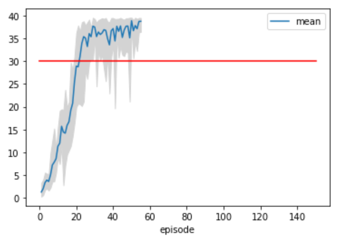

[//]: # (Image References)

[image1]: https://user-images.githubusercontent.com/10624937/43851024-320ba930-9aff-11e8-8493-ee547c6af349.gif "Trained Agent"
[image2]: https://user-images.githubusercontent.com/10624937/43851646-d899bf20-9b00-11e8-858c-29b5c2c94ccc.png "Crawler"


# Project 2: Continuous Control

### Introduction

For this project, you will work with the [Reacher](https://github.com/Unity-Technologies/ml-agents/blob/master/docs/Learning-Environment-Examples.md#reacher) environment.

![Trained Agent][image1]

In this environment, a double-jointed arm can move to target locations. A reward of +0.1 is provided for each step that the agent's hand is in the goal location. Thus, the goal of your agent is to maintain its position at the target location for as many time steps as possible.

The observation space consists of 33 variables corresponding to position, rotation, velocity, and angular velocities of the arm. Each action is a vector with four numbers, corresponding to torque applicable to two joints. Every entry in the action vector should be a number between -1 and 1.

### Distributed Training

For this project, we will provide you with two separate versions of the Unity environment:
- The first version contains a single agent.
- The second version contains 20 identical agents, each with its own copy of the environment.  

The second version is useful for algorithms like [PPO](https://arxiv.org/pdf/1707.06347.pdf), [A3C](https://arxiv.org/pdf/1602.01783.pdf), and [D4PG](https://openreview.net/pdf?id=SyZipzbCb) that use multiple (non-interacting, parallel) copies of the same agent to distribute the task of gathering experience.  

### Solving the Environment

Note that your project submission need only solve one of the two versions of the environment. 

#### Option 1: Solve the First Version

The task is episodic, and in order to solve the environment,  your agent must get an average score of +30 over 100 consecutive episodes.

#### Option 2: Solve the Second Version

The barrier for solving the second version of the environment is slightly different, to take into account the presence of many agents.  In particular, your agents must get an average score of +30 (over 100 consecutive episodes, and over all agents).  Specifically,
- After each episode, we add up the rewards that each agent received (without discounting), to get a score for each agent.  This yields 20 (potentially different) scores.  We then take the average of these 20 scores. 
- This yields an **average score** for each episode (where the average is over all 20 agents).

The environment is considered solved, when the average (over 100 episodes) of those average scores is at least +30. 

### Getting Started

1. Download the environment from one of the links below.  You need only select the environment that matches your operating system:

    - **_Version 1: One (1) Agent_**
        - Linux: [click here](https://s3-us-west-1.amazonaws.com/udacity-drlnd/P2/Reacher/one_agent/Reacher_Linux.zip)
        - Mac OSX: [click here](https://s3-us-west-1.amazonaws.com/udacity-drlnd/P2/Reacher/one_agent/Reacher.app.zip)
        - Windows (32-bit): [click here](https://s3-us-west-1.amazonaws.com/udacity-drlnd/P2/Reacher/one_agent/Reacher_Windows_x86.zip)
        - Windows (64-bit): [click here](https://s3-us-west-1.amazonaws.com/udacity-drlnd/P2/Reacher/one_agent/Reacher_Windows_x86_64.zip)

    - **_Version 2: Twenty (20) Agents_**
        - Linux: [click here](https://s3-us-west-1.amazonaws.com/udacity-drlnd/P2/Reacher/Reacher_Linux.zip)
        - Mac OSX: [click here](https://s3-us-west-1.amazonaws.com/udacity-drlnd/P2/Reacher/Reacher.app.zip)
        - Windows (32-bit): [click here](https://s3-us-west-1.amazonaws.com/udacity-drlnd/P2/Reacher/Reacher_Windows_x86.zip)
        - Windows (64-bit): [click here](https://s3-us-west-1.amazonaws.com/udacity-drlnd/P2/Reacher/Reacher_Windows_x86_64.zip)
    
    (_For Windows users_) Check out [this link](https://support.microsoft.com/en-us/help/827218/how-to-determine-whether-a-computer-is-running-a-32-bit-version-or-64) if you need help with determining if your computer is running a 32-bit version or 64-bit version of the Windows operating system.

2. Place the file in the DRLND GitHub repository, in the `p2_continuous-control/` folder, and unzip (or decompress) the file. 

## Instructions

I'm using Windows10/64 without any GPU, only CPU available on my laptop. 
Furthermore I was using Visual Studio Code and Anaconda. The development of the solution took place under Visual Studio Code and the Anaconda Shell. 

Additionally I used the Reacher version 2, the 20 Agents variants: Windows (64-bit): [click here](https://s3-us-west-1.amazonaws.com/udacity-drlnd/P2/Reacher/Reacher_Windows_x86_64.zip)

### Install Environment
1. Anaconda

Download and install: https://repo.anaconda.com/archive/Anaconda3-2020.02-Windows-x86_64.exe

2. Environment
Python 3.6 Environment and not newer is necessary because of Unity 0.4 dependencies like Tensorflow
```
    conda create -n unity_mlagent python=3.6
    conda activate unity_mlagent
```
3. Tensorflow 

    Download of wheel because pip install was not working directly
https://files.pythonhosted.org/packages/fd/70/1a74e80292e1189274586ac1d20445a55cb32f39f2ab8f8d3799310fcae3/tensorflow-1.7.1-cp36-cp36m-win_amd64.whl
```
    pip install tensorflow-1.7.1-cp36-cp36m-win_amd64.whl
```
4. Unity ML Agents

    Download Unity ml agents https://codeload.github.com/Unity-Technologies/ml-agents/zip/0.4.0b and unzip
```
    cd ml-agents-0.4.0b\python
    pip install .
```

5. Pytorch

    Pytorch will be used for the DQN Agent
```
    conda install -c pytorch pytorch
```

6. Additional packages
```
    pip install pandas git
```

7. Reacher Environment

    Download (https://s3-us-west-1.amazonaws.com/udacity-drlnd/P2/Reacher/Reacher_Windows_x86_64.zip  
    Unzip in project folder so that ```Reacher.exe```can be found

8. Install version control system Git

Download and install:
https://github.com/git-for-windows/git/releases/download/v2.26.2.windows.1/Git-2.26.2-64-bit.exe


### Perform Train and testing of DQN Agent via jupyter Notebook
1. Start python environment
    
    Call Anaconda prompt via Windows Start menu

 

```
    cd <project folder>
    conda activate drlnd
``` 

2. Clone project
```
    git clone https://github.com/AntoniaSophia/DRLND_ContinuousControl.git
    cd DRLND_ContinuousControl
```
3. Start of jupyter environment
```
    jupyter notebook
```

4. Open Solution.ipynb and follow the steps

## Description of my solution

In this chapter I describe my solution to this project. My solutions consists of the following files:
   - `Solution.ipynb` - this is the Jupyter notebook containing my solution
   - `td3_agent.py` - this is a vanilla DQN agent and contains the following parameters
     - `env` - the environment where the Reacher is contained in
     - `brain_name` - the brain_name of the Reacher
     - `max_episodes` - maximum limit of episodes to be executed
     - `threshold` - the threshhold of average reward in order to successfully finish training
     - `seed` - seed of the randomizer (keep constant in case you want to get reproducable results!)
     - `actor_filename` - the filename to store the trained agent's actor network  
     - `critic_filename` - the filename to store the trained agent's critic network  

   - `model_td3.py` - the neural network of the TD3 neural network
   - `FifoMemory.py`  - an alternative implementation of the replay memory based on a simple first-in-first-out (FIFO) eviction scheme
   - `Solution.py` - this basically has the same content as the Jupyter notebook - it was my starting point for development of the solution ("offline")


I am using the TD3 algorithm (= Twin Delayed Deep Deterministic Policy Gradient), which is the successor to the Deep Deterministic Policy Gradient (DDPG)(Lillicrap et al, 2016). 
The TD3 algorithm is addressing function approximation error in Actor-Critic methods caused by the algorithm continuously over estimating the Q values of the critic (value) network. These estimation errors build up over time and can lead to the agent falling into a local optima or experience catastrophic forgetting. TD3 addresses this issue by focusing on reducing the overestimation bias seen in previous algorithms. 

This is done with the addition of 3 key features: 
- Using a pair of critic networks (The twin part of the title)
- Delayed updates of the actor (The delayed part)
- Action noise regularisation 

The original paper for the TD3 algorithm can be found at: https://arxiv.org/abs/1802.09477

A pretty nice TD3 description can be found at (and some parts of this description) is taken from: https://towardsdatascience.com/td3-learning-to-run-with-ai-40dfc512f93

The base for implementation is taken from: https://github.com/prasoonkottarathil/Twin-Delayed-DDPG-TD3-/blob/master/TD3.ipynb

As additional changes I've implemented the following additions:
- using FIFO memory instead of a the standard replay memory (the same FIFO memory which I already used in the first project BananaCollector)
- using an additional "short term memory" which stores much fewer and thus only the most recent samples for batch training (see `td3_agent.py` line 92, 105 and 108))

       `# Short term memory contains only 1/100 of the complete memory and 
        # the most recent samples
        self.memory_short = FifoMemory(int(BUFFER_SIZE/100), int(BATCH_SIZE))`


## The neural network

The neural network can be found at the file `model_td3.py` and is basically the identical implementation from the orginal TD3 paper including all hyperparameters.
The Actor is still only one network, whereas the Critic is consisting of two networks

The input layer of the Actor receives 33 states and the output layer has size 4 with following dimensions (nodes) of the hidden layers:  `fc1_units = 400` and  `fc2_units = 300`:

       `self.fc1 = nn.Linear(state_size, fc1_units)
        self.bn1 = nn.BatchNorm1d(fc1_units)
        self.fc2 = nn.Linear(fc1_units, fc2_units)
        self.fc3 = nn.Linear(fc2_units, action_size)`


As mentioned the Critic contains two networks which conquer the potential over estimation. Both networks have identical structure, the input layer of the Critic also receives 33 states and the output layer has size 1 (Critic Q-target values) with following dimensions (nodes) of the hidden layers:  `fc1_units = 400` and  `fc2_units = 300`:

       `self.fcs1 = nn.Linear(state_size, fcs1_units)
        self.bn1 = nn.BatchNorm1d(fcs1_units)
        self.fc2 = nn.Linear(fcs1_units+action_size, fc2_units)
        self.fc3 = nn.Linear(fc2_units, 1)

        self.fcs4 = nn.Linear(state_size, fcs1_units)
        self.bn2 = nn.BatchNorm1d(fcs1_units)
        self.fc5 = nn.Linear(fcs1_units+action_size, fc2_units)
        self.fc6 = nn.Linear(fc2_units, 1)`


I simply used the model which was also used in the lesson 2 (DQN) - basically it is identical.

 

I played around with the dimensions of the hidden layers, but it seems that using `size(fc1)=Size(fc2) = 64` (both hidden layer dimensions = 64) is the optimal setting.

All other variants - either using less or increasing - finish the task only with more episodes.

## TD3 Agent

In `td3_agent.py` I've followed the implementation from the original TD3 paper, including the hints from Udacity "benchmark" to start a learning process only every 20 timesteps, but 10 iterations at each learning phase. The learning step is also delayed according to TD3 which means that the policy is only modified every second learning steps. The the implementation of the learning step function:

   def step(self, state, action, reward, next_state, done, timestep):
        """Save experience in replay memory, and use random sample from buffer to learn."""
        # Save experience / reward
        self.memory.add(state, action, reward, next_state, done)
        self.memory_short.add(state, action, reward, next_state, done)

        # Learn at defined interval, if enough samples are available in memory
        # HINT from Udacity "benchmark": learn every 20 timesteps and train 10 samples
        if len(self.memory) > BATCH_SIZE and timestep % LEARN_EVERY == 0:
            for _ in range(LEARN_NUM):
                experiences = self.memory.sample() 
                experiences_short = self.memory_short.sample() 

                # delay update of the policy and only update every 2nd training
                self.learn(experiences_short, timestep % 2,GAMMA)
                self.learn(experiences, timestep % 2 , GAMMA)

As you can see I initiate two learning cycles with identical BATCH_SIZE: 
    - one for samples of the regular memory
    - one for the samples of the short term memory


The core of the learning step is using the minimum of both Critic values for the Q-target (td3_agent.py lines 151-162) and the sum of both critic loss for backward step

        Q_targets_next1, Q_targets_next2 = self.critic_target(next_states, actions_next)

        # TD3 --> Take the minimum of both critic in order to avoid overestimation
        Q_targets_next = torch.min(Q_targets_next1, Q_targets_next2)

        # Compute Q targets for current states (y_i)
        Q_targets = rewards + (gamma * Q_targets_next * (1 - dones))
        # Compute critic loss
        Q_expected1, Q_expected2 = self.critic_local(states, actions)

        # compute critic loss [HOW MUCH OFF?] as sum of both loss from target
        critic_loss = F.mse_loss(Q_expected1, Q_targets)+F.mse_loss(Q_expected2, Q_targets)

As mentioned already above this TD3 agent comes with 3 key features: 
- Using a pair of critic networks (The twin part of the title)
- Delayed updates of the actor (The delayed part)
- Action noise regularisation 

and as additional features I've implemented the following additions:
- using FIFO memory instead of a the standard replay memory (the same FIFO memory which I already used in the first project BananaCollector)
- using an additional "short term memory" which stores much fewer and thus only the most recent sample for batch training (see `td3_agent.py` line 92, 105 and 108))


### Used parameters

In the next section I'm going to explain all the parameters I have chosen.

  - `EPSILON = 1.0` - starting with maximum exploration (when using epsilon-greedy policy) is always a good advise....
  - `EPSILON_DECAY = 1e-6` - I took this parameter from the paper XYZ
  - `seed = 1` - the seed for the randomizer (I kept it constant in order to be able to compare results)
  - `GAMMA = 0.99` - the discount factor
  - `BUFFER_SIZE = int(1e6)` - having 100000 samples to store 
  - `BATCH_SIZE = 128` - The batch size for every replay memory learning after each step
  - `WEIGHT_DECAY = 0` # L2 weight decay
  - 
  - `TAU = 1e-3` # soft updating of target params
  - `LR_ACTOR = 1e-3` # learning rate of the gradient descent of the neural network's actor
  - `LR_CRITIC = 1e-3` # learning rate of the gradient descent of the neural network's critic
  - `LEARN_EVERY = 20` # learning timestep interval (how often to update the network)
  - `LEARN_NUM = 10` # number of learning passes
  - `OU_SIGMA = 0.20` # Ornstein-Uhlenbeck noise parameter
  - `OU_THETA = 0.15` # Ornstein-Uhlenbeck noise parameter


### Other parameters

  - `max_episodes` - maximum limit of episodes to be executed
  - `threshold` - the threshhold of average reward in order to successfully finish training
  - `actor_filename` - the filename to store the trained agent's actor network  
  - `critic_filename` - the filename to store the trained agent's critic network  
  

## Discussion

Finally I was able to solve this task for the `threshold = 38.0` in ?? episodes
The trained model can be found at:
- https://github.com/AntoniaSophia/DRLND_ContinuousControl/blob/master/actor_ckpt.pth
- https://github.com/AntoniaSophia/DRLND_ContinuousControl/blob/master/critic_ckpt.pth
    
  
 

Most obviously the TD3 is really fast and stable - I guess much faster and more stable compared to all other known algorithms (even the DDPG). At least this is what is mentioned in the literature.

I'm not sure which effect my additions (using FIFO memory and an additional short term memory) have on the overall performance of my TD3 implementation. For a detailed statement I would have to run several rounds of different feature sets. But as I only have an older CPU the training process took almost 6 hours   

Basically the data structure of the regular replay memory and FIFO is almost similar, just the order of the elements is different. As already indicated in the first project "BananaCollector" my result could indicate that using a FIFO is more efficient, but in fact just running a few tests in one project is definitely not enough to conclude on that. I admit, I was just playing around with some ideas I found in the Internet....

As I recognized the calculations in Jupyter notebook are different compared to execution on command line. Executed on command line the task was even solved in ?? episodes - even much faster! I have no idea why it is like that, for your reference I've added the corresponding calculations in my Anaconda command line:
[in case someone could tell me the reason of this behavior I would be grateful]


Further potential improvements:
- ? 


## Final remark - famous last works... ;-)
As I'm completely new to deep reinforcement learning, I was really really glad when the first project came and I could start some coding. There was so much of theory and new terms and somehow I felt like having to learn 20 years of research within a few weeks. I was very happy that I could all bits and pieces together and solve the task now in much less than 50 episodes. Compared to the first project I think I have understoop almost every detail of the solution  

All in all it was a lot of fun, I really learned a lot of new things and enjoyed!

